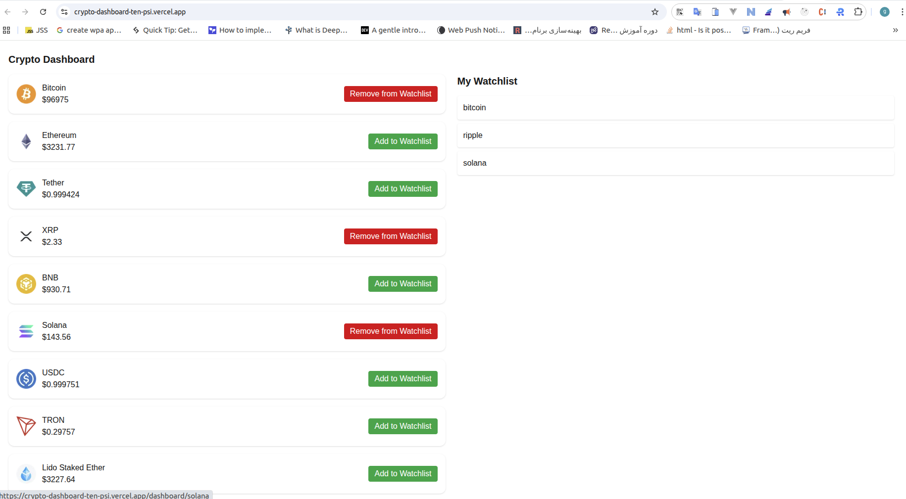

# 🪙 Crypto Dashboard

A **Next.js 13** cryptocurrency dashboard that shows real-time coin prices, detailed coin pages, and a personal watchlist. This project demonstrates **Server Actions**, **ISR**, **fetch caching**, **Client Components**, and dynamic routes in Next.js.

---

## ⚡ Features

- **Real-time prices:** Live coin price updates using WebSocket (Binance API).  
- **Detailed coin pages:** Click any coin to view its market data, including name, symbol, image, and current USD price.  
- **Watchlist:**
  - Add/remove coins to your personal watchlist
  - Server actions handle watchlist state
  - Watchlist persists across sessions
  - Buttons update dynamically when a coin is added/removed
- **Favorites:**
  - Mark coins as favorites
  - Favorites are persisted in **Local Storage**
  - Buttons update dynamically to reflect favorite state
- **Server-side fetching:** Coin data is fetched on the server using Next.js `fetch` with ISR (`revalidate`) and fetch caching.  
- **Dynamic routes:** Individual coin pages (`/dashboard/[id]`).  
- **Metadata generation:** Dynamic `<title>` and `<description>` per coin page.  
- **TypeScript types:** Full type safety for coins, coin lists, and parameters.
---

## 🧩 Project Structure

```
/app
  /dashboard
    /[id]/page.tsx       # Coin details page
    page.tsx             # Dashboard with coins, watchlist, and favorites
/lib
  crypto.ts               # Server-side fetching of coin data from CoinGecko API
/actions
  watchlist.ts            # Server Actions: add/remove coins to watchlist
  favorites.ts            # Client-side actions: add/remove coins to favorites (Local Storage)
/components
  WatchlistButton.tsx     # Button to toggle coin in watchlist
  FavoriteButton.tsx      # Button to toggle coin as favorite
  LivePrice.tsx           # Real-time coin price component using WebSocket
/types
  models.ts               # TypeScript types (Coin, CoinList, paramsType)

```

---

## 🚀 Getting Started

1. **Clone the repository:**

```bash
git clone https://github.com/gitygity/crypto-dashboard.git
cd crypto-dashboard
```

2. **Install dependencies:**

```bash
npm install
# or
yarn install
```

3. **Set environment variables:**

Create a `.env.local` file at the root:

```
COINGECKO_API_KEY=<your_api_key>
```

4. **Run the development server:**

```bash
npm run dev
# or
yarn dev
```

Open [http://localhost:3000/dashboard](http://localhost:3000/dashboard) to view your dashboard.


---

## 🛠 Next.js Capabilities Used

- **Server Actions:**  
  Manage watchlist and favorites server-side without client API calls. Changes are applied on the server and UI updates with `revalidatePath`.

- **ISR & Fetch Caching:**  
  Fetch coin data with automatic revalidation (`revalidate`) to improve performance and reduce redundant requests.

- **Dynamic Routes:**  
  `/dashboard/[id]` for individual coin details pages.

- **Client Components:**  
  - `LivePrice` → real-time price updates via WebSocket.  
  - `WatchlistButton` & `FavoriteButton` → interactive client-side components.

- **Metadata Generation:**  
  Dynamic `<title>` and `<description>` for coin detail pages using `generateMetadata`.

- **TypeScript Support:**  
  Type safety for API responses and props.

- **Local Storage Integration:**  
  Favorites managed in local storage and synced with UI dynamically.

- **WebSocket Integration:**  
  Display live coin prices using Binance WebSocket API.

- **`revalidatePath` Usage:**  
  Updates other pages after server actions to keep UI in sync without full page reload.

---

## 🌐 Live Demo

Check out the deployed version of the Crypto Dashboard:

[https://crypto-dashboard-ten-psi.vercel.app/](https://crypto-dashboard-ten-psi.vercel.app/)

The live demo showcases real-time coin prices, watchlist management, favorites, and dynamic coin pages.

---

## 💻 Screenshots




---


## 📌 Notes

- Watchlist updates are immediate thanks to **Server Actions** and Next.js `revalidatePath`.  
- `LivePrice` uses WebSocket; for HTTPS in development, run the server with HTTPS enabled.  
- All API calls are **server-side**; client never exposes your API key.
